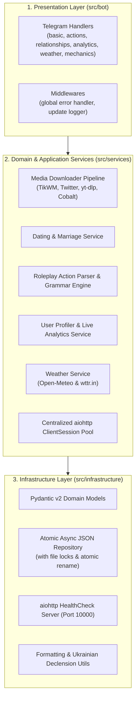

# 🌲 BugaichyBot (Vanilla Clean Architecture Edition)

<div align="center">

[](https://python.org)
[](https://python-telegram-bot.org)
[](https://blog.cleancoder.com/uncle-bob/2012/08/13/the-clean-architecture.html)
[](https://docs.pydantic.dev/)
[](https://docs.astral.sh/ruff/)
[](https://mypy-lang.org/)
[](https://www.docker.com/)

**High-performance, event-driven Telegram community bot built with Clean Architecture, non-blocking asynchronous I/O, domain validation, and a multi-engine social media downloader.**

[English](#-overview-en) • [Українська](#-огляд-ua)

</div>

---

## 🇺🇦 Огляд (UA)

**BugaichyBot Vanilla** — це масштабований Telegram-бот для ком'юніті та групових чатів, розроблений за принципами **Clean Architecture (чистої архітектури)** та **Domain-Driven Design**.

Він поєднує гейміфікацію (вільні рольові дії, шлюби/стосунки, картки психологічних портретів), аналітику активності чату, прогноз погоди та каскадний асинхронний завантажувач медіа без водяних знаків (TikTok, Instagram Reels, YouTube Shorts, Twitter/X).

### ✨ Ключові можливості
* 🎬 **Multi-Engine Video Downloader:** автоматичне розпізнавання та каскадне завантаження відео (Direct TikWM/fxtwitter API $\rightarrow$ оптимізований `yt-dlp` $\rightarrow$ Cobalt API fallback) з автоматичним очищенням тимчасових файлів через асинхронні контекстні менеджери.
* 🎭 **Вільна рольова система (Roleplay):** гнучкий парсинг дій (`!обійняв`, `!пригостив кавою`) з граматичним відмінюванням імен в українській мові та генерацією клікабельних HTML-посилань.
* ❤️ **Система стосунків та шлюбів:** інтерактивні пропозиції з інлайн-кнопками, рівні стосунків, спільні дії (+очки), захист від дублювання та розрив стосунків.
* 👤 **Профілі та аналітика:** картки користувачів із динамічними вкладками (Огляд, Роль & Стиль, Психоаналіз, Теми, Сленг, Статистика), відстеження активності та реакцій.
* 🎲 **Розваги та утиліти:** сюжетна РП-рулетка (50 подій), прогноз погоди (Open-Meteo з бекапом на wttr.in) та монетка.
* 🌐 **Production-Ready Web Healthcheck:** вбудований неблокуючий вебсервер `aiohttp.web` для проходження Health Check на Render, Railway, Fly.io та UptimeRobot.

---

## 🏛️ Архітектура системи (Clean Architecture)

Проєкт розділений на незалежні ізольовані шари:



---

## 📂 Структура репозиторію

```text
bugaichybot/
├── .env.example              # Шаблон змінних середовища
├── .dockerignore             # Виключення для Docker
├── .gitignore                # Файли, виключені з Git
├── Dockerfile                # Багатоетапний безпечний образ
├── pyproject.toml            # Метадані проєкту, конфігурація Ruff та Mypy
├── requirements.txt          # Виробничі залежності
├── main.py                   # Зворотньосумісний файл запуску
├── data/
│   ├── chat_analytics.json   # Офлайн-портрети та історія чату
│   └── live_analytics.json   # Щоденна статистика активності
├── src/
│   ├── main.py               # Головна точка входу з graceful lifecycle
│   ├── core/
│   │   ├── config.py         # Типізовані налаштування на pydantic-settings
│   │   └── logger.py         # Централізоване логування
│   ├── bot/
│   │   ├── app.py            # Фабрика Application та реєстрація хендлерів
│   │   ├── middlewares/      # Глобальні обробники помилок
│   │   └── handlers/         # Тонкі презентаційні хендлери Telegram
│   ├── services/
│   │   ├── media_downloader/ # Каскадний конвеєр завантаження відео
│   │   ├── dating_service.py # Бізнес-логіка стосунків та шлюбів
│   │   ├── rp_service.py     # Парсинг та відмінювання дій
│   │   ├── user_profiler.py  # Психологічні профілі та статистика
│   │   ├── weather_service.py# Прогноз погоди
│   │   └── http_client.py    # Пул aiohttp з'єднань
│   └── infrastructure/
│       ├── constants/        # Константи, рівні, відмінювання імен
│       ├── db/
│       │   ├── models.py     # Pydantic v2 схеми
│       │   └── repository.py # Атомарне сховище з локами
│       ├── web/
│       │   └── health.py     # aiohttp вебсервер для моніторингу
│       └── utils/            # Допоміжні утиліти форматування та очищення
```

---

## 🚀 Встановлення та запуск

### 1. Локальний запуск (Local Development)

```bash
# 1. Клонувати репозиторій
git clone https://github.com/your-username/bugaichybot.git
cd bugaichybot

# 2. Створити та активувати віртуальне середовище
python3 -m venv venv
source venv/bin/activate  # На Windows: venv\Scripts\activate

# 3. Встановити залежності
pip install -r requirements.txt

# 4. Налаштувати змінні середовища
cp .env.example .env
# Відредагуйте .env і вкажіть ваш BOT_TOKEN

# 5. Запустити бота
python main.py
```

### 2. Запуск у Docker (Production)

```bash
# Збірка контейнера
docker build -t bugaichybot:latest .

# Запуск контейнера
docker run -d \
  --name bugaichybot \
  --restart unless-stopped \
  --env-file .env \
  -p 10000:10000 \
  bugaichybot:latest
```

---

## 🧪 Якість коду та перевірки

Кодова база повністю відповідає стандартам **PEP 8**, типізована через **Mypy** та перевірена лінтером **Ruff**:

```bash
# Форматування та лінтинг
ruff check src/
ruff format src/

# Сувора перевірка типів
mypy src/
```

---

## 🛡️ Безпека та надійність
* **Concurrency-Safe I/O:** per-chat асинхронні блокування (`asyncio.Lock`) та атомарний запис у файл через тимчасові файли усувають ризик пошкодження JSON-даних при одночасних запитах.
* **Auto-recovery:** автоматична обробка мережевих збоїв та Telegram `409 Conflict` (при розгортанні нового контейнера до завершення старого).
* **Non-blocking Event Loop:** усі синхронні операції з файлами та завантаженням через `yt-dlp` виконуються виключно через пул воркерів `asyncio.to_thread`.
* **Zero-Leak Media Storage:** усі медіафайли зберігаються в ізольованих тимчасових директоріях і гарантовано видаляються після відправки.

---

<div align="center">
    <i>Розроблено з любов'ю до чистого коду та українського ком'юніті 🌾</i>
</div>