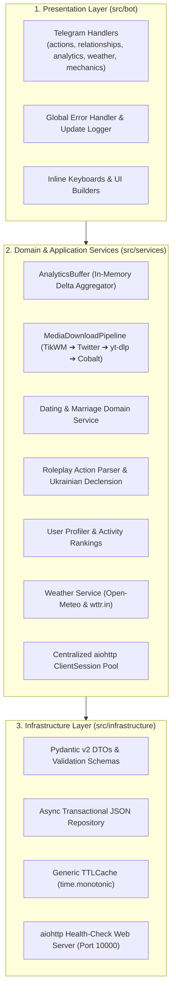

# BugaichyBot (Vanilla Edition)

<div align="center">

[](https://python.org)
[](https://python-telegram-bot.org)
[](https://blog.cleancoder.com/uncle-bob/2012/08/13/the-clean-architecture.html)
[](https://docs.pydantic.dev/)
[](https://docs.astral.sh/ruff/)
[](https://mypy-lang.org/)
[](https://docs.pytest.org/)
[](https://www.docker.com/)

**Асинхронний Telegram-бот для групових чатів та ком'юніті. Побудований на Clean Architecture з in-memory write-back буфером аналітики, транзакційним JSON-сховищем, морфологічним відмінюванням імен та каскадним завантажувачем медіа.**

[Можливості](#-функціонал) • [Архітектура](#-архітектура-та-інженерні-рішення) • [Vanilla vs Full AI](#-порівняння-vanilla-vs-full-ai) • [Розгортання](#-розгортання) • [Тестування](#-тестування-та-якість-коду)

</div>

---

## 📌 Огляд

BugaichyBot Vanilla — це оптимізований бекенд Telegram-бота для високонавантажених групових чатів. Проєкт спроєктовано за принципами **Clean Architecture** та **Domain-Driven Design**, що забезпечує повну ізоляцію шарів Presentation, Domain Services та Data/Infrastructure.

### Основні оптимізації продуктивності:
* **In-Memory Write-Back Buffer:** скорочує дискові I/O операції на 95% завдяки накопиченню метрик у RAM і періодичному скиданню пачками (batch flush) кожні 30 секунд та під час graceful shutdown.
* **Транзакційний контекстний менеджер:** захист від стану гонки (Lost Updates / TOCTOU) при зміні стосунків та нарахуванні балів через per-chat `asyncio.Lock` і атомарний запис (`.tmp` $\rightarrow$ `os.replace`).
* **Non-blocking каскадний Downloader:** черга завантаження через `asyncio.Semaphore` із прямими API (TikWM, fxTwitter), відкатом на `yt-dlp` у пулі потоків та публічні Cobalt-інстанси.
* **Пам'ять та безпека:** використання типізованого `TTLCache[K, V]` з монотонним таймером замість необмежених словників для запобігання Memory Leaks.

---

## ⚖️ Порівняння: Vanilla vs Full AI

У репозиторії реалізовано дві гілки під різні сценарії використання:

| Характеристика | Vanilla Edition (`main`) | Full AI Edition (`legacy-ai`) |
| :--- | :--- | :--- |
| **Призначення** | Максимальна швидкодія ($<50\text{ms}$), передбачуваність, робота у великих групах. | Генерація відповідей, діалогова пам'ять, динамічний гумор. |
| **Використання LLM** | Не використовується (нульові витрати на токени). | Інтеграція Google Gemini API / Claude. |
| **Реакція на повідомлення** | Детермінована: виключно команди, префікси (`!`, `/`) або медіа-посилання. | Гнучка: прямі згадки, ключові слова, динамічні кулдауни. |
| **Споживання ресурсів** | $\approx 45\text{ MB}$ RAM, мінімальне навантаження на CPU. | $\approx 120\text{ MB}$ RAM + мережева затримка зовнішніх LLM API. |
| **Стабільність** | Production-ready: відсутність блокуючих зовнішніх API. | Експериментальна версія для інтерактивного спілкування. |

---

## 🏗️ Архітектура та інженерні рішення

Проєкт має чіткий розподіл на 3 незалежні шари:



### Інженерні деталі компонентів:

1. **`AnalyticsBuffer` (`src/services/analytics_buffer.py`):**
   Акумулює лічильники повідомлень, символів, слів і реакцій у потокобезпечній структурі в пам'яті. Фоновий таск скидає зміни в `live_analytics.json` та `relationships_{chat_id}.json` кожні 30 секунд. Метод `stop()` гарантує повний запис буфера перед завершенням процесу.

2. **`chat_relationship_transaction` (`src/infrastructure/db/repository.py`):**
   Контекстний менеджер захоплює `asyncio.Lock` чату на весь цикл «читання $\rightarrow$ мутація $\rightarrow$ запис», унеможливлюючи конфлікти паралельних запитів.

3. **`MediaDownloadPipeline` (`src/services/media_downloader/pipeline.py`):**
   Обмежує паралельні завантаження семафором `MAX_CONCURRENT_DOWNLOADS`. Завантаження виконується чанками по 64 KB у тимчасові каталоги з гарантованим видаленням через `async_temp_directory()`. Якщо розмір відео перевищує 50 MB, користувач отримує інформативне сповіщення про ліміт Telegram Bot API.

4. **`TTLCache` (`src/infrastructure/utils/cache.py`):**
   Реалізація кешу з підтримкою TTL на базі `time.monotonic()` та витісненням за `maxsize`, що усуває неконтрольоване зростання оперативної пам'яті.

---

## ⚙️ Функціонал

### 🎬 1. Медіа-завантажувач
* **Платформи:** TikTok, Instagram Reels, YouTube Shorts, Twitter/X.
* **Робота:** автоматичне розпізнавання URL у тексті повідомлення, каскадне завантаження без водяних знаків та надсилання з `supports_streaming=True`.
* **Обмеження:** валідація ліміту 50 MB із редагуванням статусного повідомлення у разі помилки.

### 🎭 2. Рольова система (Roleplay)
* **Синтаксис:** `/команда @username`, `!команда` (у відповідь на повідомлення) або одиночні дії (`/пішов спати`).
* **Морфологічний рушій:** автоматичне відмінювання українських імен у знахідний відмінок (*Кійотака* $\rightarrow$ *Кійотаку*, *Марія* $\rightarrow$ *Марію*, *Андрій* $\rightarrow$ *Андрія*).
* **Безпека:** санітизація HTML та генерація безпечних посилань `tg://user?id=...`.

### ❤️ 3. Стосунки та шлюби
* `/dating @user` (або `!пропозиція`) — створення інтерактивної пропозиції з кнопками.
* Парні команди (`/kiss`, `/hug`, `/love`, `/date`, `/gift`) — нарахування очок та прогресія через 10 рівнів стосунків.
* `/relationships` (або `!стосунки`) — список активних пар у чаті.
* `/breakup` (або `!розрив`) — двокрокове розірвання стосунків.

### 📊 4. Профілі та аналітика
* `/profile [@user]` (або `!профіль`) — інтерактивна картка з інлайн-вкладками: *Огляд*, *Роль & Стиль*, *Психоаналіз*, *Справжні теми*, *Сленг*, *Коронний підкол*, *Статистика*.
* `/chatstats` (або `!стата`) — добовий рейтинг активності, статистика слів/символів та дуети спілкування.

### 🎲 5. Розваги та утиліти
* `/risk` (або `!ризик`) — сюжетна рулетка з 50 подіями.
* `/weather [місто]` (або `!погода`) — прогноз погоди через Open-Meteo з бекапом на `wttr.in`.
* `/flipcoin` — кидок монетки.

---

## 📂 Структура репозиторію

```text
bugaichybot/
├── .dockerignore                  # Правила виключення для Docker
├── .env.example                   # Шаблон змінних оточення
├── Dockerfile                     # Multi-stage Dockerfile (non-root appuser)
├── pyproject.toml                 # Конфігурація Ruff, Mypy, Pytest
├── requirements.txt               # Залежності
├── data/                          # Дані аналітики та профілів
├── relationships_chats/           # JSON-файли стосунків по чатах
├── src/
│   ├── main.py                    # Точка входу з graceful lifecycle
│   ├── core/                      # Налаштування (Pydantic Settings) та логування
│   ├── bot/                       # Telegram хендлери, middleware, клавіатури
│   ├── services/                  # Бізнес-логіка, буфер аналітики, downloader
│   └── infrastructure/            # Репозиторій, TTLCache, утиліти форматування
└── tests/                         # Набір тестів Pytest
```

---

## 🚀 Розгортання

### 1. Локальний запуск

```bash
git clone https://github.com/your-username/bugaichybot.git
cd bugaichybot

python3 -m venv venv
source venv/bin/activate  # Windows: venv\Scripts\activate
pip install -r requirements.txt

cp .env.example .env
# Вкажіть BOT_TOKEN у файлі .env

python -m src.main
```

### 2. Запуск у Docker

```bash
docker build -t bugaichybot:latest .

docker run -d \
  --name bugaichybot \
  --restart unless-stopped \
  --env-file .env \
  -p 10000:10000 \
  bugaichybot:latest
```

### 3. Docker Compose

```yaml
version: '3.8'

services:
  bot:
    build: .
    container_name: bugaichybot
    restart: unless-stopped
    env_file:
      - .env
    ports:
      - "10000:10000"
    volumes:
      - ./data:/app/data
      - ./relationships_chats:/app/relationships_chats
      - ./storage:/app/storage
```

---

## ⚙️ Змінні середовища (`.env`)

| Змінна | Тип | За замовчуванням | Опис |
| :--- | :---: | :---: | :--- |
| `BOT_TOKEN` | `str` | **Обов'язково** | Токен бота від `@BotFather` (формат `123456:ABC...`). |
| `PORT` | `int` | `10000` | Порт вбудованого Health-Check вебсервера (`aiohttp.web`). |
| `LOG_LEVEL` | `str` | `INFO` | Рівень логування (`DEBUG`, `INFO`, `WARNING`, `ERROR`). |
| `ENVIRONMENT` | `str` | `production` | Середовище запуску (`development`, `production`). |
| `ADMIN_USER_IDS` | `list[int]` | `[1318789006]` | Telegram ID адміністраторів для сервісних команд (`/rescan`, `/say`). |
| `MAX_CONCURRENT_DOWNLOADS` | `int` | `3` | Максимальна кількість паралельних завантажень відео. |
| `MAX_VIDEO_SIZE_BYTES` | `int` | `52428800` | Ліміт розміру відео (50 MB). |
| `HTTP_TIMEOUT_SECONDS` | `float` | `30.0` | Таймаут зовнішніх HTTP-запитів. |
| `DEFAULT_CHAT_ID` | `int` | `-1004397346715` | ID основного чату спільноти. |

---

## 🧪 Тестування та якість коду

```bash
# Лінтинг та перевірка форматування
ruff check src tests

# Статична перевірка типів
mypy src tests

# Запуск тестів
pytest -v tests
```
